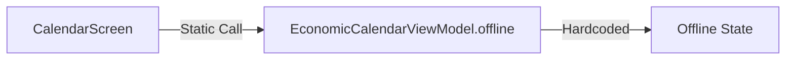

# Calendar Data Sources Map

**Current State:** D47 (Audit)

## Data Flow

## Inventory
- **Source:** Hardcoded Static Method (`EconomicCalendarViewModel.offline()`)
- **Transport:** None (In-Memory)
- **Artifact:** None
- **Endpoint:** None

## Status
- **Freshness:** ALWAYS `OFFLINE`
- **Integrity:** N/A (Stub)
